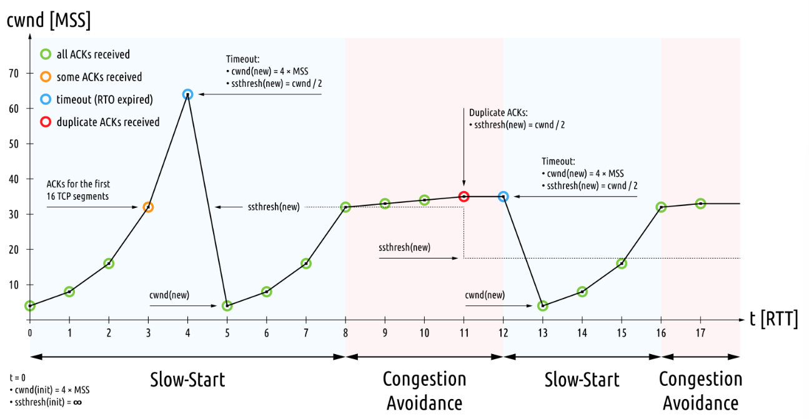

# TCP/UDP
## 1 TCP/UDP 개요
### 1.1 전송 계층의 역할 (세그먼트화, 포트 기반 통신)
네트워크 계층 위에서 동작하며, **종단 간(end-to-end) 통신**을 담당한다.  
- **세그먼트화**  
    상위 계층(응용)의 데이터를 작게 쪼개어 세그먼트로 나눈다.
  
- **재조립**  
    수신 측에서 세그먼트를 순서대로 다시 합쳐 원래 데이터로 복원한다.
  
- **포트 기반 통신**  
    각 애플리케이션을 포트 번호로 구분하여 통신한다.
  
- **다중화 / 역다중화**  
    여러 애플리케이션의 데이터를 하나의 송수신 경로(스트림)로 묶어 주고 받을 수 있게 한다.
### 1.2 포트 / 소켓 개념
- **포트(Port)**  
    네트워크 통신 시, 한 컴퓨터 내에서 여러 프로세스를 구분하기 위한 번호이다.  
    → IP 주소가 '호스트'를 식별한다면, **포트 번호는 '호스트 내의 프로세스'를 식별**한다.
  
- **소켓(Socker)**  
    "애플리케이션이 네트워크 통신을 위해 사용하는 통로"  

    애플리케이션은 OS 위에서 동작하고, **네트워크 통신은 OS 커널이 담당**한다. (IP, TCP/UDP 프로토콜도 모두 커널이 관리한다.)  
    → 따라서 애플리케이션은 직접 네트워크 장치를 제어하지 못하고, **네트워크를 이용하기 위해서는 OS를 거쳐야 함**.  
    → 프로세스는 OS에 **소켓(socket)** 을 요청해 통신에 사용할 **논리적 통로(인터페이스)** 를 할당받는다.  
    각 소켓은 **소켓 구조체**로 만들어지고, 그 구조체를 가리키는 fd가 있다. 프로세스는 이 fd를 통해 시스템 콜로 데이터를 송수신한다.  

    각 소켓은 `IP 주소 + 포트번호`로 식별되는 통신 종단점이다. ex) `192.168.0.5:443`  
    - **TCP**: 연결 기반으로 `(Src IP, Src Port, Dst IP, Dst Port)` 4튜플로 연결을 식별/구별한다.  
    - **UDP**: 비연결형이므로 `(Src Port, Dst Port)` 2튜플로 소켓을 식별/구별한다.  

        - **UDP가 포트번호만으로 통신을 구분해도 되는 이유**  
            TCP는 연결을 맺어서 신뢰성 보장을 위한 상태를 관리해야 한다. 하지만, UDP는 TCP와 같이 연결을 맺는 과정이 없다. UDP를 통한 각 데이터 전송은 개별적이고, 연결 상대에 따라 개별적으로 유지해야 할 정보가 없다. 단지 데이터를 받고 송수신하기 위한 애플리케이션의 포트번호만 알면 된다.
### 1.3 Multiplexing / Demultiplexing
- **다중화(Multiplexing)**  
    "여러 응용 프로그램의 데이터를 하나의 네트워크 연결로 보냄 (송신)"  

    → 여러 개의 상위 계층 데이터가 하나의 하위 계층을 통해 동시에 흐를 수 있게 하는 기술  
    → **물리적으로 합치는 것이 아니라, OS 수준에서 여러 소켓의 데이터를 논리적으로 관리하며 같은 네트워크 통로를 통해 전송하는 것**이다.
  
- **역다중화(Demultiplexing)**  
    "네트워크 계층에서 올라온 데이터를 전송 계층이 받아서, 각기 다른 응용 프로세스 소켓으로 올바르게 전달하는 과정 (수신)"  

    → **누구에게 전달해야 하는지 식별해서 올바른 소켓으로 분배하는 과정**
  
- **TCP와 UDP에서의 차이**  
    커넥션(세션)의 유무 때문에 작동 방식이 다르다.
  
    - **TCP**  
        - 4튜플로 연결을 식별함.
        - 식별 단위: 연결(Connection)
        - 연결 상태를 유지해서 **각 세션별 송수신 버퍼가 존재**함.
          
    - **UDP**  
        - 2튜플로 어떤 소켓으로 보낼지 결정함.
        - 식별 단위: 소켓(socket)
        - 연결 상태가 없고, **포트별 수신 버퍼만 존재**함.
          
    - **송수신 버퍼가 무엇인지?**  
        소켓 구조체에는 송신 큐와 수신 큐가 버퍼 역할을 하고, 여기에서 각 패킷 구조체인 `sk_buff` 객체를 저장한다.
## 2 TCP
### 2.1 TCP 특징 / 구조
- **특징**
  
    - **신뢰성 보장**  
        손실, 중복, 순서 뒤바뀜 등을 감지하고 재전송을 통해 신뢰성 있는 데이터 전송을 보장
      
    - **연결 지향형**  
        3-way handshake를 통한 연결 설정 / 4-way termination을 통한 연결 해제
      
    - **순서 보장(Ordered Delivery)**  
        TCP는 각 세그먼트에 순서 번호를 붙여 송신 순서와 동일하게 수신 측에서 재조립
      
    - **흐름 제어(Flow Control)**  
        송신 측이 수신 측의 처리 속도를 초과하지 않도록 **수신 윈도우(Window Size)** 기반으로 전송 속도를 조절
      
    - **전이중 통신(Full Duplex)**  
        송수신이 동시에 가능하고, 각 방향마다 독립적인 버퍼와 시퀀스 번호를 관리
- **TCP 세그먼트 구조**  
    TCP는 데이터를 세그먼트 단위로 전송한다.  
    헤더는 기본 20바이트에서 최대 60바이트까지 늘어날 수 있다.  
    송신/수신 측 포트 번호와 세그먼트 순서 번호(Sequence Number), Window Size, Checksum 등이 들어간다.
    - **SEQ(Sequence Number, 순서 번호)**  
        "내가 지금 보내는 데이터의 첫 번째 바이트가 전체 스트림에서 몇 번째 바이트인지"
      
    - **ACK(Acknowledgement Number, 확인 응답 번호)**  
        "내가 지금까지 상대방으로부터 잘 받은 마지막 바이트 다음 번호"  

        → 너의 데이터 중에 어디까지 잘 받았고, ACK부터 받으면 된다는 의미이다.
      
- **세그먼트 동작 요약**  
    **MSS(Maximum Segment Size)**를 기준으로 응용 계층에서 받은 데이터를 세그먼트로 나눈다.  
    → 각 세그먼트는 IP 계층을 통해 전송되고, 수신 측에서 순서를 복원하고 오류를 검출한다.  
    → 수신 측은 정상적으로 수신한 세그먼트에 대해 **ACK**를 반환한다.  
    → 손실된 세그먼트가 있으면 송신 측은 타이머 기반으로 재전송한다.(일정 시간 안에 ACK가 오지 않으면 재전송)  

    - **MSS(Maximum Segment Size)**  
        한 번에 전송할 수 있는 **TCP 데이터(payload)의 최대 크기**  
        → TCP 세그먼트에서 데이터 부분의 최대 크기  

        MSS는 **MTU에서 IP와 TCP 헤더 크기를 뺀 나머지 값**이다.  
        → 일반적으로 1500 - 20 - 20 = 1460바이트
      
### 2.2 연결 관리
- **3-way handshake**  
    TCP는 데이터를 전송하기 전에 송신자와 수신자 간의 연결을 설정해야 한다.  
    → 이때 두 호스트는 서로 **시퀀스 번호 초기값(ISN, Initial Sequence Number)을 교환**하고 양방향 통신 준비를 확인한다.  
    - **과정**  

        여기서 말하는 `SYN`, `ACK` 등은 **TCP 헤더 안의 제어 플래그(flag big)가 설정**된 하나의 TCP 세그먼트를 말한다.
        
        1. **`SYN` - 클라이언트에서 서버로 자신의 ISN과 함께 연결 요청**  
            `SYN` 플래그를 보낸다.  
            ISN은 random 설정한다.(보안 상의 이유로 랜덤으로 예측 불가능하게 함)  
            클라이언트 상태는 `SYN_SENT`가 된다.
           
        2. **`SYN+ACK` - 서버에서 클라이언트로 요청 수락과 서버의 ISN을 전송**  
            서버는 `SYN`을 받고, 자신도 연락을 수락하기 위해 `SYN`을 전송한다.  
            클라이언트의 `SYN`에 대해 `ACK(ack=x+1)`을 응답한다.  
            서버도 자신의 random ISN을 생성해서 응답에 싣어 보낸다.  
            서버 상태는 `SYN_RECIEVED`가 된다.
           
            - **TCP 옵션 협상**  
                3-way handshake의 `SYN`/`SYN+ACK` 패킷에서 교환된다.  
                → 연결이 완전히 맺어지기 전에, **양쪽이 지원 가능한 기능을 서로에게 알리고 조율**한다.  

                협상하는 것: MSS, Window Size 등
              
                - **예시) MSS 협상**  
                    클라이언트에서 서버로 자기의 MSS를 보낸다.  
                    → 서버에서 클라이언트로 자기의 MSS를 보낸다.  
                    → 그리고 각자 둘 중 더 작은 값을 현재 연결의 MSS로 사용한다.
                  
        3. **`ACK` - 클라이언트에서 서버로 서버의 응답에 대한 확인**  
            클라이언트가 서버의 `SYN+ACK`에 대해 `ACK(ack=y+1)`을 전송한다.  
            이때부터 양쪽 모두 데이터 전송이 가능해진다.  
            연결 상태는 `ESTABLISHED`가 된다.
           
    - **왜 3번인가?**  
        각 방향의 ISN을 서로 교환하고 확인해야 한다.  
        → 3번째 ACK를 통해 서버 SYN도 클라이언트에게 수신이 완료된 것을 보장함.
      
    - **만약 마지막 `ACK`가 손실되면?**  
        "손실되어도 연결은 정상적으로 성립된다."  

        - **클라이언트**  
            마지막 `ACK`를 보낸 순간 클라이언트는 이미 `ESTABLISHED`로 데이터를 전송할 수 있는 상태가 된다.
          
        - **서버**  
            마지막 `ACK`가 오지 않으면 TCP 타이머에 따라 기다리고, 타이머가 만료되면 `SYN+ACK`를 재전송한다.  
            → 서버는 두 번째 `ACK`를 받고 `ESTABLISHED`로 전환한다.
          
        - **또 손실되면?**  
            서버는 지수 backoff 방식으로 타이머를 기다린 후, `SYN+ACK`를 재전송한다. 그리고 일정 횟수 이상 실패 시 세션을 제거한다.
          
    - **유실이나 혼잡 등의 이유로 마지막 `ACK`보다 클라이언트 측의 이후 전송된 데이터가 먼저오면?**  
        TCP 정의에 따르면 해당 데이터 세그먼트가 이미 보낸 `SYN`과 일치하는 연결의 것이라면(올바른 시퀀스 번호를 포함하고 있다면), 이 데이터 세그먼트를 수용하고 해당 세그먼트에 대한 `ACK`를 반환하면서 서버의 상태를 `ESTABLISHED`로 변경한다.
      
    - **Sequence Number**  
        TCP 연결은 양방향으로 각각 독립된 시퀀스 번호 공간(sequence space)을 가진다.  
        → 양쪽이 독립적으로 데이터 전송 상태 추적이 가능하다.  

        수신 측의 `ACK` 번호는 다음 기대하는 바이트 번호이다.  
        → 수신측이 받은 TCP 헤더의 sequence 번호가 1000이고, 데이터 크기가 100바이트이면, 응답 헤더의 ACK는 1100이 된다. (1099까지 잘 받았고, 1100을 달라)
       
- **4-way termination**  
    TCP 연결은 양방향 독립적으로 종료된다.  
    → 한쪽이 먼저 닫고 다른 쪽이 나중에 닫는다.  
    → 그래서 4단계를 거치게 된다.
  
    - **과정**  
        "연결을 끊는 쪽 = 더 이상 보낼 데이터가 없는 쪽"  

        (아래 예시는 A가 B에게 연결 종료를 먼저 요청하는 경우다.)
      
        1. **`FIN`: 송신자(A)가 데이터 전송을 마치면 연결 종료를 요청**  
            A는 송신 버퍼만 닫는다.  

            A의 상태 전이: `ESTABLISHED` → `FIN_WAIT_1`  
            (`FIN_WAIT_1`: 내가 `FIN`을 보냈고, 상대 `ACK`가 아직 오지 않음)
           
        2. **`ACK`: `FIN` 수신 확인(B는 아직 전송 중일 수 있음)**  
            B의 상태 전이: `ESTABLISHED` → `CLOSE_WAIT`  
            (`CLOSE_WAIT`: `FIN`을 받았지만, 내가 아직 안 보낸 상태)  

            A의 상태 전이: `FIN_WAIT_1` → `FIN_WAIT_2`  
            (`FIN_WAIT_2`: 내 `FIN`에 대한 `ACK`는 받았지만, 상대 `FIN`이 오지 않음)
           
        3. **`FIN`: B가 데이터 전송이 완료되었으면 A에게 종료 요청**  
            B의 상태 전이: `CLOSE_WAIT` → `LAST_ACK`  
            (`LAST_ACK`: 내가 `FIN`을 보냈고, 그에 대한 `ACK`를 기다리는 중)
           
        4. **`ACK`: A가 `FIN`에 대해 B에게 `ACK`를 보내고 종료 완료**  
            A의 상태 전이: `FIN_WAIT_2` → `TIME_WAIT` → `CLOSED`  
            (`TIME_WAIT`: 모든 `FIN/ACK`가 끝났지만, 혹시 재전송 된 `FIN`이 올까봐 잠시 대기(보통 2 * MSL 대기))  

            B의 상태 전이: `LAST_ACK` → `CLOSED`  
            (B는 `FIN`에 대한 `ACK`를 받게 되면 TCP 연결이 완전히 종료된 것이기 때문에 바로 `CLOSED`가 된다.  
            → **먼저 종료한 쪽(A)만 `TIME_WAIT`을 거친다.**)
           
    - **2 * MSL을 기다리는 이유?**  

        - **MSL(Maximum Segment Lifetime)**  
            각 OS마다 설정된, 네트워크 상에서 하나의 TCP 세그먼트가 살아 있을 수 있는 최대 시간을 의미한다. (리눅스 기준 30초)
          
        - **이유 1 - 마지막 ACK 손실 대비**  
            나중에 종료하는 쪽의 `FIN`에 대한 `ACK` 응답이 손실될 경우 `FIN`이 재전송될 수 있다.  
            → 2 * MSL을 기다리면서 재전송 될 `FIN`에 대한 `ACK`를 주기 위해 기다린다. (왕복을 고려하면 2 * MSL이 적절하다.)
          
            - **그럼 재전송 된 `FIN`이 올 경우 다시 2 * MSL을 기다려야 하는거 아닌가?**  
                맞다. 다시 타이머를 2 * MSL로 초기화한다.
              
        - **이유 2 - 지연된 패킷 혼선 방지**  
            연결을 먼저 닫고 바로 새 연결을 같은 `(IP, Port)` 조합에 대해 열어버릴 경우, 지연된 패킷이 혼선을 일으킬 수 있다.  
            → 이전 연결의 세그먼트가 혼선을 주지 않도록 연결을 바로 닫지 않고 기다린다.
          
    - **`CLOSED`가 되면 어떻게 되나?**  
        어느쪽이든 `CLOSED`가 된 시점에서 TCP 연결에 사용된 모든 커널 리소스가 먼저 정리된다.  

        먼저 종료한 쪽: `ACK` 손실 대비(`TIME_WAIT`) 후 커널 리소스가 완전히 정리된다.  
        나중에 종료한 쪽: 자신의 `FIN`에 대한 `ACK` 확인 후 즉시 리소스 해제
      
- **Keep-Alive (연결 유지 확인)**  
    "TCP 연결이 오래 유지되는 동안 상대가 살아 있는지 확인하기 위한 주기적 점검 메커니즘"  

    - **동작 방식**  
        일정 시간 동안 양쪽에서 데이터 전송이 없으면, 송신 측이 `Keep-Alive probe` 패킷을 전송함.  
        → 상대방이 응답(`ACK`)을 보내면 연결은 유지됨  
        → 응답이 없으면 일정 횟수 재시도 후에 연결이 끊어진 것으로 판단하여 연결을 종료함.
      
    - **목적**  

        - **끊긴 연결 감지**  
            장시간 유휴 연결의 비정상 종료 감지
          
        - **끊김 방지**  
            NAT, 방화벽 등에서 세션이 강제로 끊어지는 것을 사전에 방지  
            (NAT 장비나 방화벽이 유휴 TCP 세션을 정리할 때 같이 정리되지 않도록 아직 살아있다고 신호를 주는 것임)
          
        - **주체인 송신 측이 어디인가?**  
            송신 측은 TCP Keep-Alive를 활성화한 호스트를 말한다.  

            서버가 설정했으면 서버가 확인 패킷을 주기적으로 전송  
            클라이언트가 설정했으면 클라이언트가 확인 패킷을 주기적으로 전송
          
        - **누가 설정하는지?**  
            OS는 아무것도 하지 않고, **애플리케이션(프로세스)에서 소켓 옵션을 통해 직접 활성화**해야 한다.  
            → 이때 이 주체는 TCP 클라이언트나 서버 중 **어느 한쪽으로 고정되어 있지 않다.** 경우와 구현에 따라 다르다.  

            일반적인 웹 요청에서는 거의 사용되지 않고, DB 연결이나 WebSocket, IoT 통신에서는 매우 자주 사용된다.  

            **일반적인 경우**  
            → TCP 클라이언트가 설정  

            **장기 연결 서버**  
            → WebSocket이나 IoT인 경우 서버가 설정할 수도 있다.
          
### 2.3 신뢰성 메커니즘
- **순서 보장(Sequencing)**  
    각 세그먼트에 순서 번호(Sequence Number)를 부여하여 수신 측이 올바른 순서로 재조립 가능하게 한다.
  
    - **받은 데이터의 순서가 어긋날 경우**  
        임시로 버퍼(reassembly buffer)에 저장해둔다.  
        → 누락된 부분이 도착하면 합쳐서 상위 계층(응용 계층)에 순서대로 전달한다.
      
- **재전송(Retransmission)**  
    일정 시간 동안 `ACK`가 오지 않으면 해당 세그먼트를 **타임아웃 후 재전송**한다.
  
    - **RTO(Retransmission Timeout) 기반 재전송**  
        보낸 데이터에 대한 `ACK`가 일정 시간(RTO) 내에 도착하지 않으면, 송신자는 타임아웃으로 해당 데이터를 재전송한다.
      
    - **RTO 값**  
        RTT의 평균과 분산을 이용해 **동적으로 계산**  
        (RTO = SRTT + 4 * RTTVAR)
      
    - **빠른 재전송(Fast Retransmit)**  
        수신자는 데이터를 받았을 때, 응답으로 **아직 받지 못한 가장 앞쪽의 데이터 번호(ACK)** 를 보낸다.  

        → 이게 여러 번 왔다는 뜻은 그 못받은 데이터가 단순 지연으로 인한 것이 아닐 확률이 높다는 것이다.  
        ⇒ 수신자가 **중복된 ACK를 3번 보낼 경우**, 송신자는 타임아웃을 기다리지 않고 **즉시 재전송**한다.
        ⇒ 그래서 **빠른 재전송**이다.
      
    - **빠른 회복(Fast Recovery)**  
        중복 `ACK`가 계속 들어오고 있다면, 네트워크가 혼잡하긴 하지만 그 이후의 세그먼트들은 여전히 전달되고 있다는 뜻이다.  

        → 네트워크가 혼잡하긴 하지만 완전히 막힌 것은 아님.  
        → 그래서 **혼잡 윈도우(`cwnd`)를 1로 줄이는 것이 아니라 절반으로만 줄인다.**  
        ⇒ 원래의 혼잡 윈도우 상태로 돌아오는 시간이 빠르다.  
        ⇒ 그래서 **빠른 회복**이다.
      
- **흐름 제어(Flow Control)**  
    **송신자가 수신자의 버퍼를 초과해 데이터를 보내지 않도록 조절**하는 기능이다.  

    → 수신자는 매 `ACK`마다 헤더로 **`rwnd`(Receive Window, 수신 윈도우)** 값을 송신자에게 알려준다.  
    → **수신자가 받을 수 있는 버퍼의 여유 크기**를 의미한다.  
    → 송신자는 매 `ACK`를 받을 때마다 얼마나 한번에 수신자에게 더 보낼 수 있는지 판단한다.  
    (실제는 `min(rwnd, cwnd)`를 기준으로 전송한다.
  
    - **zero window**  
        만약 수신자가 버퍼가 꽉 차서 `rwnd=0`을 보낸다면, 송신자는 전송을 멈춘다.
      
- **혼잡 제어(Congestion Control)**  
    **네트워크 혼잡 시 전송 속도를 줄여** 패킷 손실을 방지한다.  
    → 수신자가 아닌 **네트워크 전체의 안정성을 위한 제어**이다.  

    송신자는 "네트워크 혼잡 상태에 따른 전송 가능량"을 나타내는 **`cwnd`(Congestion Window, 혼잡 윈도우)** 를 스스로 관리해서 송신 속도를 조절한다.
  
    - **주요 알고리즘**  
        
        (이미지 출처 - [File:TCP Slow-Start and Congestion Avoidance.svg](https://commons.wikimedia.org/wiki/File:TCP_Slow-Start_and_Congestion_Avoidance.svg))  

        - **느린 시작(Slow Start)**  
            처음에 `cwnd`는 1 MSS로 시작하고, `ACK`를 받을 때마다 지수적으로 증가한다. (RTT마다 2배씩 늘어남)
          
        - **Congestion Avoidance**  
            임계값(ssThresh)을 넘으면 완만하게(선형) 증가한다.
          
        - **타임아웃 발생 시 동작?**  
            위의 이미지에서 처럼 처음 타임아웃(RTO 타이머 만료)이 발생하면, Congestion Avoidance를 위한 임계값(ssThresh)을 현재 `cwnd`의 절반으로 설정하고, `cwnd`를 1로 설정한다.  

            ssThresh를 현재 `cwnd`의 절반으로 설정하는 이유는, `cwnd`는 지수적으로 증가시키는데, 그 이전(현재의 절반)까지는 타임아웃 없이 성공한 것이기 때문에 그 이전인 절반으로 설정한다.
          
        - **빠른 회복(Fast Recovery)**  
            위에서 언급했듯이, 중복 `ACK`가 들어오는 경우에는 `cwnd`를 1이 아닌 절반으로 줄인다.
          
- **오류 검출(Checksum)**  
    **TCP 헤더와 데이터 전체에 대해** 체크섬을 계산해서 오류를 감지한다.  

    → 수신 측은 받은 세그먼트 전체를 다시 계산해서, 합이 0이 아니면 오류로 판단한다.  
    → 복구는 TCP 수준에서는 하지 않고, 재전송으로 처리한다.
  
### 2.4 전송 효율 관련
- **Nagle 알고리즘**  
    TCP 헤더는 기본 20바이트이고 60바이트까지 늘어날 수 있다. 근데 각 세그먼트에 데이터를 **몇 바이트의 작은 바이트를 보내면 전송 효율이 매우 떨어지게** 된다.  
    
    → 첫 데이터는 즉시 전송  
    → 그 다음 데이터는 이전 데이터의 `ACK`를 받을 때까지 버퍼에 모아둠  
    → `ACK`가 오면 그동안 쌓인 데이터를 한 번에 전송  
    ⇒ 작은 패킷들을 묶어 전송하기 때문에 **전송 효율이 올라간다.**
  
    - **단점**  
        지연이 생길 수 있다.  
        → 게임이나 채팅에서는 `TCP_NODELAY` 옵션으로 Nagle을 비활성화한다.
      
- **Delayed ACK**  
    TCP 에서 수신 측이 모든 데이터에 대해 개별 `ACK`를 보내면 ACK flood라고 하는 `ACK` 전송이 매우 많아지는 사태가 발생할 수 있다.  
    
    → 최대 200ms 정도 기다리면서 **응답할 데이터**나 다음 세그먼트가 오면 **`ACK`를 함께 보낸다.**  
    ⇒ `ACK` 트래픽 감소 ⇒ 네트워크 효율 향상
  
- **소규모 데이터 전송 지연 문제(Nagle + Delayed ACK 지연)**  
    Nagle 알고리즘과 Delayed ACK 알고리즘이 동시에 작동하면, **"서로 기다리는" 현상**이 발생할 수 있다.  
    (타이머가 있어서 계속 기다리지는 않는다.)
  
## 3 UDP
### 3.1 UDP 특징 / 구조
- **연결 없음(Connectionless)**  
    3-way handshake 없이 바로 보낸다.  
    상태를 유지하지 않는다.  

    → 지연이 낮고 오버헤드가 적다.
  
- **비신뢰적(Unreliable)**  
    재전송/순서 보장/흐름 제어/혼잡 제어 없음.  

    → 손실/중복/순서바뀜을 애플리케이션에서 감당한다.
  
- **메시지 경계 보존(Message Boudary Preservation)**  
    보낸 `datagram` 단위가 그대로 전달된다.  

    TCP의 경우는 `send("Hello"), send("World")`를 보내더라도 연속된 스트림으로 처리해서 보내는 과정에서 두 데이터의 구분이 없어질 수 있다.  

    UDP는 이 **보낸 데이터와 받는 데이터가 그대로 보존되어서 전송**된다.  
    ⇒ 보내는 메시지를 "덩어리 단위"로 구분해서 그대로 전달.
  
- **브로드캐스트/멀티캐스트 지원**  
    TCP의 경우는 3-way handshake를 통해 일대일로 세션을 연결하고 통신을 한다.  
    **UDP**는 비연결형이고 `ACK`가 없기 때문에, 브로드캐스트와 멀티캐스트가 가능하다.  
    ex) DNS, DHCP, 스트리밍, 게임
  
- **헤더**  
    UDP는 헤더가 8바이트로 매우 작다.  
    딱 양쪽 포트 번호와 (헤더+데이터)의 길이, 체크섬 값만 들어간다.
  
- **체크섬**  
    세그먼트 전체에 대한 체크섬 값을 제공해서 오류를 검출할 수 있다.  
    But, **복구는 하지 않는다.** 데이터가 손상되었어도 다시 받는 메커니즘이 없다.
  
### 3.2 TCP vs UDP 비교

| 구분                 | **TCP (Transmission Control Protocol)**               | **UDP (User Datagram Protocol)**                   |
| ------------------ | ----------------------------------------------------- | -------------------------------------------------- |
| **계층 위치**          | 전송 계층 (L4)                                            | 전송 계층 (L4)                                         |
| **연결 방식**          | **연결형(Connection-oriented)** — 3-way handshake로 연결 설정 | **비연결형(Connectionless)** — 별도 연결 절차 없음             |
| **데이터 전송 단위**      | **바이트 스트림(Stream)** — 연속된 데이터 흐름                      | **메시지 단위(Message / Datagram)** — 보낸 덩어리 그대로 유지     |
| **메시지 경계**         | 보존 ❌ — `send()` 여러 번 해도 경계 사라짐                        | 보존 ✅ — 보낸 datagram 단위 그대로 수신                       |
| **신뢰성 보장**         | ✅ 있음 — 재전송, 순서 제어, 오류 검출, 흐름 제어                       | ❌ 없음 — 손실·순서보장 없음 (필요시 앱이 직접 처리)                   |
| **오류 검출**          | 체크섬(Checksum)으로 오류 검출 + 재전송으로 복구                      | 체크섬(Checksum)으로 오류 검출만, 복구는 없음                     |
| **순서 보장**          | ✅ 있음 (시퀀스 번호, 재정렬 기능)                                 | ❌ 없음 (도착 순서 불확실)                                   |
| **흐름 제어**          | ✅ 있음 (수신 윈도우 `rwnd`)                                  | ❌ 없음                                               |
| **혼잡 제어**          | ✅ 있음 (혼잡 윈도우 `cwnd`, AIMD 등)                          | ❌ 없음                                               |
| **전송 속도**          | 상대적으로 느림 (신뢰성 보장으로 인한 오버헤드)                           | 빠름 (제어 절차가 거의 없음)                                  |
| **헤더 크기**          | 20~60바이트                                              | 8바이트                                               |
| **브로드캐스트 / 멀티캐스트** | ❌ 지원 안 함                                              | ✅ 지원 (DNS, DHCP 등 사용)                              |
| **대표 사용 예시**       | HTTP/HTTPS, FTP, SMTP, SSH 등 **신뢰성이 필요한 통신**          | DNS, DHCP, VoIP, 스트리밍, 게임 등 **지연이 중요하고 약간의 손실 허용** |
| **연결 종료**          | 4-way handshake                                       | 없음 (필요시 애플리케이션 수준에서 종료 판단)                         |

### 3.3 사용 사례
- **VoIP/영상통화, 실시간 스트리밍, 온라인 게임**  
    손실 몇 % 감수하고도 일관된 저지연이 더 중요한 경우.  
    (+ 앱이 자체 보정)
  
- **브로드캐스트/멀티캐스트**
  
- **현재 웹/전송 프레임워크의 기반**  
    **QUIC(HTTP/3)**  

    → 구글에서 개발한 전송 계층 프로토콜로, 이후 IETF에 의해 표준화되었다.  
    → 원래는 "Quick UDP Internet Connections"의 약자였으나, 현재는 "QUIC"라는 이름으로 사용된다.  
    → UDP 위에서 동작하고, TCP+TLS처럼 신뢰성 있고 암호화된 통신을 제공하면서도 지연(latency)을 줄이고자 설계되었다.
