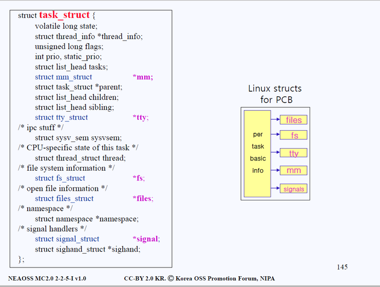

# 프로세스 관리
## 1 프로세스 vs 스레드
### 1.1 프로세스(Process)
> "실행 중인 프로그램"  

-> 디스크에 있던 실행 파일이 메모리에 적재됨.  
-> OS가 자원(Resource)을 할당하는 기본 단위이다.

- **주요 구성 요소**  

    - **Code(텍스트 영역)**  
        실행할 명령어들이 저장됨.

    - **Data 영역**  
        전역 변수, 정적 변수
    
    - **Heap 영역**  
        동적 메모리 (new/malloc 등)
    
    - **Stack 영역**  
        함수 호출 시 지역 변수, 매개 변수, 리턴 주소 등 저장
    
    ⇒ 이 4개가 프로세스 주소 공간(Process Address Space)을 구성한다.

- **특징**  

    - 프로세스 마다 독립적인 메모리 공간을 가짐 (OS에 의해 보호됨)

    - 하나가 죽어도(비정상 종료) 다른 프로세스에는 영향이 없음 (완전한 독립)

    - OS는 각 프로세스의 상태를 **PCB(Process Control Block)**으로 관리함

### 1.2 스레드(Thread)
> "프로세스 내에서 실행되는 흐름의 단위"  

-> 하나의 프로세스가 여러 일을 동시에 수행하기 위해 **분리된 실행 흐름**이다.

- **특징**  
    
    - 같은 프로세스 내에서도 **메모리 공간(코드, 데이터, 힙)을 공유**한다.

    - **스택과 레지스터 값은 스레드마다 독립적으로 존재**한다. (PCB를 통해 저장한다. 스택 같은 경우는 스택 포인터를 PCB에 저장한다.)  
        -> 스레드 간 함수 호출 독립성 확보
    
    - 스레드끼리는 **공유 데이터 접근 시 동기화(Synchronization)** 필요

    - 모든 스레드는 하나의 프로세스에서 같은 **파일 디스크립터 테이블 공유**  
        -> 모든 스레드가 하나의 FD 테이블을 바라본다.  
        -> 같은 파일, 같은 소켓을 공유하며 동시에 I/O 처리 가능(이때 동기화 필요)

- **장점**  

    - 프로세스에 비해 생성/종료/전환 비용이 작음

    - 데이터 공유가 쉬워 통신이 빠름 (IPC 불필요)  
        -> 힙 공간이 공유되는 덕분임.

- **단점**  

    - 하나의 스레드에서 오류가 나면, 같은 프로세스의 모든 스레드에 영향 가능  
        (공유 자원 훼손 가능성)
    
    - 동기화로 인한 교착 상태(Deadlock), 레이스 컨디션(Race Condition) 위험 존재

### 1.3 프로세스 vs 스레드
| 구분             | **프로세스 (Process)**                         | **스레드 (Thread)**                           |
| -------------- | ------------------------------------------ | ------------------------------------------ |
| **정의**         | 실행 중인 프로그램의 인스턴스                           | 프로세스 내에서 실행되는 **작업 단위(실행 흐름)**             |
| **자원 소유**      | 독립적인 메모리 공간(Code, Data, Heap, Stack)을 가짐   | Code, Data, Heap은 공유하고 **Stack만 개별적으로 가짐** |
| **주소 공간**      | 프로세스마다 독립적                                 | 동일 프로세스 내에서 공유                             |
| **통신(데이터 공유)** | 기본적으로 불가능 → IPC 필요 (파이프, 큐 등)              | 같은 프로세스 내에서 변수 공유 가능                       |
| **오버헤드**       | 생성 및 전환 비용 큼 (독립된 PCB, 주소 공간 복사)           | 상대적으로 적음 (공유 메모리 사용)                       |
| **안정성**        | 한 프로세스의 오류가 다른 프로세스에 영향 X                  | 한 스레드 오류 시 전체 프로세스에 영향 O                   |
| **스케줄링 단위**    | CPU 스케줄러의 기본 단위 (PCB 단위로 관리)               | 프로세스 내부에서 OS 또는 사용자 레벨에서 스케줄링              |
| **문맥 교환 비용**   | 크다 (페이지 테이블 등 교체 필요)                       | 작다 (레지스터, 스택만 교체)                          |
| **예시**         | 크롬의 여러 창(프로세스)                             | 한 창 안의 여러 탭 또는 렌더링 스레드                     |
| **통신 방식**      | IPC (Pipe, Message Queue, Shared Memory 등) | 전역 변수, 힙 메모리 공유로 직접 가능                     |
| **운영체제 관점**    | 독립 실행 단위                                   | 경량 실행 단위(Lightweight Process)              |

### 1.4 리눅스에서의 프로세스와 스레드
- **표현**  
    리눅스에서는 프로세스와 스레드 모두 `task_struct` 구조체로 표현된다.  
    그리고 **공유 자원의 범위에 따라 프로세스인지, 스레드인지 구분된다.  

    -> 주소 공간(`mm_struct`), 파일 디스크립터 테이블(`files_struct`) 등을 공유하면 스레드로 간주된다.

- **스케줄링 및 실행 단위**  
    리눅스 스케줄러는 프로세스 단위가 아닌 **테스크(`task_struct`) 단위로 스케줄링**한다.  

    -> 스레드도 독립적으로 CPU에서 스케줄링 되는 실행 단위이다.  
    -> **같은 프로세스의 스레드 간 스위칭인 경우에는 주소 공간을 공유하기 때문에, 페이지 테이블 교체나 TLB flush가 필요 없으며, 스위칭 비용이 훨씬 저렴**하다.

## 2 PCB(Process Control Block)
> "운영체제가 프로세스의 상태와 실행 정보를 관리하기 위해 유지하는 자료구조"

### 2.1 역할
- **프로세스 식별**  
    프로세스를 구분하기 위해 PIC(Process ID) 등을 저장한다.

- **CPU 문맥 저장**  
    CPU 레지스터, PC 등 현재 실행 상태를 저장하여 문맥 교환 시 복원한다.
    
- **스케줄링 관리**  
    프로세스 상태(Ready/Running/Blocked), 우선순위, 사용 시간 등 스케줄링 관련 정보를 저장한다.

- **메모리 관리**  
    프로세스가 사용하는 코드, 데이터, 스택 영역의 시작 주소, 페이지 테이블 포인터 등을 저장한다.

- **입출력 관리**  
    열린 파일 목록, 사용 중인 입출력 장치 정보를 관리한다.

- **프로세스 제어**  
    부모/자식 프로세스 관계, 시그널, 통신 정보를 관리한다.

### 2.2 리눅스의 PCB
리눅스에서는 PCB가 **`task_struct` 구조체로 구현**되어 있다.  

리눅스에서 스레드는 **경량 프로세스(Lightweight Process)**로 구현된다.  
커널은 **모든 실행 단위(프로세스 및 스레드)를 `task_struct` 하나로 표현**하며, 이를 **태스크(Task)**라고 부른다.  

-> 각 프로세스/스레드 마다 하나의 PCB(`task_struct`)가 존재.  
-> 하지만, 같은 프로세스의 스레드들은 **일부 필드(`mm`, `files`, `signal` 등)를 공유**한다.

- **주요 구성 요소**  
    
    (이미지 출처 - [네이버블로그-리눅스 PCB(Process Control Block)- task_struct](https://blog.naver.com/eldkrpdla121/220696668120))  

    | 필드명                   | 설명                                         |
    | --------------------- | ------------------------------------------ |
    | `pid`                 | 프로세스 ID                                    |
    | `state`               | 실행 상태 (TASK_RUNNING, TASK_INTERRUPTIBLE 등) |
    | `mm`                  | 프로세스의 주소 공간 정보(`mm_struct`)                |
    | `files`               | 열린 파일 테이블(`files_struct`)                  |
    | `signal`              | 시그널 핸들러 정보                                 |
    | `prio`                | 스케줄링 우선순위                                  |
    | `thread`              | CPU 문맥(레지스터, 스택 포인터 등)                     |
    | `parent` / `children` | 부모·자식 프로세스 관계                              |

- **공유하는 필드**  
    `mm`, `files`, `signal`, `fs`, `files` 등

## 3 문맥 교환(Context Switching)
### 3.1 정의
> "CPU가 실행 중인 프로세스(또는 스레드)를 다른 프로세스로 교체하는 과정"  

- **문맥(Context)이란?**  
    CPU가 해당 프로세스를 다시 실행하기 위해 필요한 모든 정보  
    -> 이를 **PCB**에 저장하고 관리한다.  

    ex) 레지스터 상태 값,  
    메모리 관리 정보(페이지 테이블, 세그먼트 정보),  
    프로세스 상태 정보(Ready, Running 등)

### 3.2 동작 과정
1. 인터럽트 발생 (타이머, I/O 완료 등)

2. 현재 실행 중인 프로세스의 상태를 PCB에 저장

3. 스케줄러가 다음 실행할 프로세스 선택

4. 새 프로세스의 PCB로부터 문맥 복원

    - **복원되는 정보**  
        CPU 레지스터 집합, 커널 스택 포인터, 프로세스 상태 플레그, 페이지 테이블 교체(프로세스 간 전환인 경우)

    - TLB flush

5. CPU가 새로운 프로세스 실행 시작

### 3.3 비용(Overhead)
Context Switching은 CPU가 실제 작업을 하지 않고 OS 관리만 하는 시간이기 때문에 Overhead(성능 손실)로 간주된다.  
    
- **레지스터/캐시 손실**  
    프로세스 간 전환 시 CPU 캐시가 무효화됨
    
- **TLB 미스**  
    페이지 테이블 변경으로 TLB가 무효화됨

- **커널 모드 전환 비용**  
    시스템 콜/인터럽트 처리 중 커널 진입 및 복귀 비용이 발생함

⇒ 프로세스 전환이 스레드 전환보다 훨씬 비싸다 (프로세스는 주소 공간 자체가 바뀌기 때문이다.)

### 3.4 최적화 방법
- **스레드 사용**  

- **CPU affinity**  
    스레드(task)가 실행될 수 있는 CPU 코어 집합을 지정하는 설정이다.  

    리눅스에서는 각 task마다 `cpu_allowed`라는 값이 있어서, 이 값이 그 스레드가 실행 가능한 코어의 마스크(CPU mask)를 나타낸다.  
    ex) 0b0011 -> CPU 0, CPU 1에서만 실행 가능한 task

    - **실제 동작**  
        스레드가 생성될 때 기본적으로 부모 스레드의 affinity를 상속 받는다.  
        -> 같은 프로세스면 같은 affinity
    
    - **Lightweight context switching(경량 문맥 교환)**  
        스레드 간 전환처럼 일반 Context Switching보다 교체해야 할 문맥(Context)가 적은 것을 말한다.
    
    - **비선점형 스케줄링**  
        CPU 강제 회수를 줄인다.

## 4 프로세스 상태 전이(Process State Transition)
### 4.1 기본 상태 5단계
### 4.2 상태 전이 트리거
### 4.3 추가 상태
## 5 IPC(Inter-Process Communication)
### 5.1 파이프(Pipe)
### 5.2 메시지 큐(Message Queue)
### 5.3 공유 메모리(Shared Memory)
### 5.4 세마포어(Semaphore), 뮤텍스(Mutex)
### 5.5 소켓(Socket)