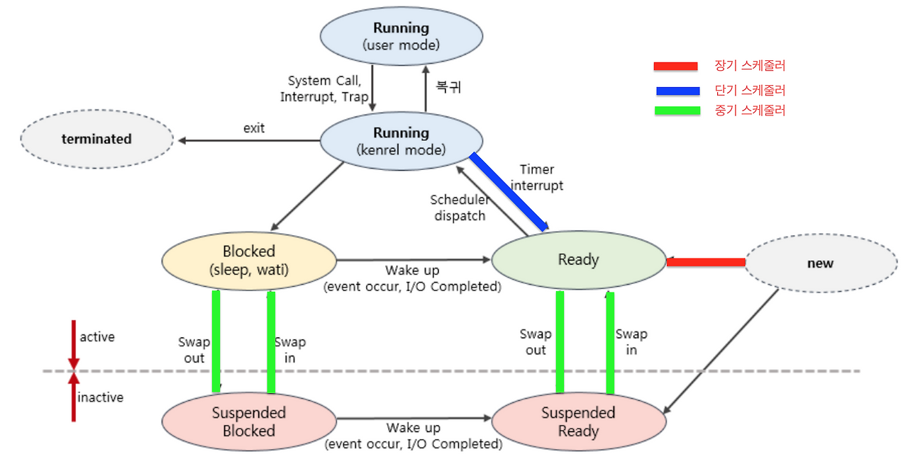

# 스케줄링(Scheduling)
## 1 스케줄링의 개요
### 1.1 정의와 목적
> "한정된 CPU 자원을 여러 프로세스가 효율적으로 공유하도록 CPU 사용 순서와 시점을 결정하는 작업."  

- **정의**  
    준비 상태(ready)인 프로세스 중 하나를 선택해 CPU를 할당하는 과정.

- **목적**  
    
    - 시스템 자원의 효율적 활용  

    - 응답 시간 단축  

    - 처리량(throughput) 증가  

    - 공정성(fairness) 확보  

### 1.2 CPU 버스트와 I/O 버스트, CPU-bound vs I/O-bound
- **CPU Burst, I/O Burst**  
    프로세스의 실행은 **CPU 실행(연산)**과 **I/O 대기(입출력)**의 반복으로 구성된다.  

    - **CPU Burst**: 프로세스가 CPU에서 한 번에 연속적으로 실행되는 시간  
    - **I/O Burst**: 프로세스가 I/O 작업을 요청하고 결과를 기다리는 시간  

    -> 프로세스를 실행하면, CPU Burst와 I/O Burst가 번갈아가며 나타난다.  

- **CPU-bound vs I/O-bound**  

    - **CPU-bound 프로세스**  
        CPU Burtst가 많은 프로세스 = CPU를 많이 사용하는 프로세스  
        ex) 동영상 편집 프로그램, 머신러닝 프로그램
    
    - **I/O-bound 프로세스**  
        I/O Burst가 많은 프로세스 = I/O를 많이 사용하는 프로세스  
        ex) 백엔드 API 서버(DB나 캐시에 요청을 보내는 경우가 많음)

### 1.3 스케줄러의 종류
- **장기 스케줄러(Long-term Scheduler, Job Scheduler)**  
    디스크에 있는 프로그램 중 어떤 프로세스를 **메모리에 올려서 프로세스로 만들지 결정**한다.

    - **개입 시점**  
        어떤 프로세스의 탄생 순간에 단 한 번 개입한다.  
        `New` -> `Ready` 상태 전이 시점에 개입한다.
    
    - **주요 목표**  
        멀티프로그래밍 정도 조절  
            너무 많으면 -> 문맥 전환 오버헤드 증가  
            너무 적으면 -> CPU 유휴시간 증가

- **중기 스케줄러(Medium-term Scheduler)**  
    > "메모리에 적재된 프로세스 수 관리"  
    
    메모리 압박 시, 일부 프로세스를 Swap Out(보조 기억장치로 내보냄) 하거나, 다시 Swap In(복귀) 시켜 메모리 부하를 완화한다.  

    - **개입 시점**  
        프로세스를 메모리에서 디스크로 내보내거나(Swap Out), 디스크에서 다시 메모리로 불러올 때(Swap In) 개입한다.
    
    - **주요 목표**  

        - 메모리 부하 조절  
            너무 많은 프로세스가 메모리를 과다하게 차지하면, Swapping 과정에서 Swap Out을 수행하는 과정으로 인해 CPU가 I/O 대기에 너무 많은 시간을 소모하게 된다.

        - 멀티프로그래밍 정도(Degree of Multiprogramming) 유지  
            실시간으로 "적정 프로세스 수"를 유지한다.

- **단기 스케줄러(Short-term Scheduler, CPU Scheduler)**  
    > "Ready Queue에 있는 프로세스 중 다음에 CPU를 쓸 프로세스 선택"  

    실질적인 CPU 스케줄링은 모두 단기 스케줄러가 수행한다.

    - **개입 시점**  
        프로세스가 CPU를 할당받거나 빼앗길 때 개입한다.  
        -> 그래서 다음에 실행될 프로세스를 결정한다.

    - **주요 목표**  

        - CPU 이용률 극대화

        - 응답 시간 최소화

        - 대기 시간/반환 시간 최소화

        - 공정성 보장

### 1.4 프로세스 상태 전이와 Ready Queue (개입 지점 명확화)
- **프로세스 상태 전이**  
    
    (이미지 출처 - [티스토리-박연호의 개발 블로그](https://kosaf04pyh.tistory.com/191)) 

    - **기본 상태 5단계**  
        - **New (생성)**  
            프로세스 생성 중(PCB, 메모리 할당 전)
            
        - **Ready (준비)**  
            실행할 준비 완료, Ready Queue에서 CPU를 기다리는 중
            
        - **Running (실행)**  
            CPU를 점유하여 명령어를 수행 중
            
        - **Wating/Blocked (대기)**  
            I/O 요청 등으로 CPU가 아닌 다른 이벤트를 기다리는 중
            (Wating Queue에서 대기)
            
        - **Terminated (종료)**  
            실행 완료되어 자원이 해제된 상태
    - **상태 전이 트리거**  
        - **New → Ready**  
            프로세스 생성 완료, 스케줄러에 등록
            
        - **Ready → Running**  
            스케줄러가 CPU 할당 (Dispatch)
            
        - **Running → Waiting**  
            I/O 요청 등으로 CPU 반납
            
        - **Running → Ready**  
            타이머 인터럽트로 CPU 강제 회수 (선점형 스케줄링)
            
        - **Waiting → Ready**  
            I/O 완료, 이벤트 발생
            
        - **Running → Terminated**  
            프로세스 실행 완료 (exit)
    - **추가 상태**  
        - **Suspended(중단)**  
            프로세스가 메모리에서 디스크로 스왑아웃됨
            
        - **Blocked-Suspend**  
            I/O 대기 중이면서 메모리에서 내려간 상태
            
        - **Ready-Suspend**  
            실행 준비는 됐지만 메모리엔 없음 (Swap-In 필요)

- **스케줄러의 개입 시점**  
    | 상황                | 상태 전이             | 개입 스케줄러   |
    | ----------------- | ----------------- | --------- |
    | 프로세스 생성           | `New` → `Ready`       | 장기 스케줄러   |
    | 실행 대기             | `Ready` → `Running`   | 단기 스케줄러   |
    | 타이머 만료 / 선점       | `Running` → `Ready`   | 단기 스케줄러   |
    | I/O 요청            | `Running` → `Waiting` | - (자연 발생) |
    | I/O 완료            | `Waiting` → `Ready`   | 단기 스케줄러   |
    | 메모리 부족 시 swap-out | `Ready` → `Suspended` | 중기 스케줄러   |

- **Ready Queue**  
    Ready 상태의 프로세스들이 대기하는 큐  
    단기 스케줄러는 이 큐에서 프로세스를 하나 선택해 CPU에 전달한다.  

    **큐의 순서 결정이 바로 스케줄링 알고리즘의 정책**에 해당한다.  
    -> 스케줄링이란 **Ready Queue의 흐름을 통제하는 기술**이다.

## 2 스케줄링 메커니즘
### 2.1 Dispatcher
> "Dispatcher(디스패처)는 스케줄러가 선택한 프로세스를 **실제 CPU에 올려 실행시키는 역할**을 하는 구성 요소이다."  

-> 스케줄러가 다음 프로세스를 결정하고, 디스패처가 이를 CPU에 넘겨준다.  

- **주요 기능**  
    - 문맥 교환
    - 모드 전환
    - 프로세스 복귀

### 2.2 선점 vs 비선점
- **선점형(Preemptive)**  
    > "운영체제가 강제로 CPU를 회수할 수 있는 방식"  

    -> 타이머 인터럽트나 우선순위에 의해 CPU를 뺏을 수 있음  
    -> 현재 실행 중인 프로세스가 강제로 Ready 상태로 돌아감  
    -> 응답성 우수, 하지만 문맥 교환 오버헤드 증가  

    ex) RR, SRTF, Priority

- **비선점형(Non-preemptive)**  
    > "프로세스가 스스로 CPU를 반납할 때까지 실행"  

    -> OS가 강제로 CPU를 빼앗지 않음  
    -> 실행 중인 프로세스는 종료하거나 I/O 요청할 때까지 유지  

    ex) FCFS, SJF, Priority

- **비교**  
    | 구분      | 선점형      | 비선점형          |
    | ------- | -------- | ------------- |
    | CPU 회수  | 강제 가능    | 자진 반납         |
    | 응답 속도   | 빠름       | 느림            |
    | 구현 난이도  | 높음       | 낮음            |
    | 문맥 전환   | 잦음       | 적음            |
    | 대표 알고리즘 | RR, SRTF | FCFS, 비선점 SJF |

### 2.3 인터럽트, 타이머 기반 선점 구현
- **선점형이 가능한 이유: 인터럽트**  
    CPU를 강제로 뺏는 방법은 결국 **인터럽트(Interrupt)** 덕분이다.  
    CPU는 **인터럽트 신호**를 받으면 즉시 현재 작업을 멈추고 커널로 진입한다.

    - **인터럽트(Interrupt)**  
        인터럽트란, 

        | 유형                             | 예시               | 설명                       |
        | ------------------------------ | ---------------- | ------------------------ |
        | **외부 인터럽트 (External)**         | 타이머, I/O 완료      | 하드웨어 장치에서 발생 (CPU 외부 요인) |
        | **내부 인터럽트 (Internal)**         | 0으로 나누기, 페이지 폴트  | CPU 내부에서 발생 (예외 상황)      |
        | **소프트웨어 인터럽트 (Software Trap)** | 시스템 호출 (syscall) | 명시적 명령으로 커널 코드 호출        |

- **타이머 기반 선점**  

### 2.4 우선순위 역전(Priority Inversion) & 해결(PI/PC)
> 낮은 우선순위 프로세스가 자원을 점유한 상태에서, 높은 우선순위 프로세스가 그 자원을 기다리며 블록되는 현상.  

-> 우선순위가 뒤집히는 현상  

- **예시**  

- **해결 방법**  

## 3 스케줄링 평가 지표
### 3.1 성능 지표 개요
### 3.2 공정성 vs 효율성
### 3.3 Starvation & Aging
### 3.4 예시 계산

## 4 주요 스케줄링 알고리즘
### 4.1 FCFS(First Come First Served)
### 4.2 SJF / SRTF
### 4.3 Priority Scheduling
### 4.4 RR(Round Robin)
### 4.5 Multilevel Queue
### 4.6 MLFQ(Multilevel Feedback Queue)
### 4.7 Real-Time Scheduling

## 5 커널 구현 관점
### 5.1 스케줄러의 핵심 구조
- **`task_struct`의 주요 필드**  
- **Runqueue(`rq`) 구조와 per-CPU 설계**  
- **Work-Conserving 여부**  
- **Ready Queue의 잠금(lock)과 동시성 처리**  
### 5.2 스케줄링 흐름과 컨텍스트 스위칭
- **`schedule()` 함수 호출 타이밍**  
- **`pick_next_task()`로의 제어 흐름**  
- **Context Switching 과정**  
- **Lazy switching / TLB flush 영향**  
### 5.3 태스크 상태 전환과 선점
- **Sleep -> Wake-up 경로**  
- **Wakeup-preemption**  
- **I/O 완료 인터럽트 시점의 스케줄링 개입**  
- **Blocking vs Non-blocking Sleep (I/O wait과의 관계)**  
### 5.4 선점 모델과 커널 응답성
- **`CONFIG_PREEMPT_NONE`/`VOLUNTARY`/`PREEMPT`/`PREEMPT_RT` 비교**  
- **커널 코드 내 preemption point (`cond_resched()`, `preempt_enable()`)**  
- **Latency vs Throughput 트레이드오프**  
- **RT(PREEMPT_RT) 패치의 구조적 변화**  

## 6 멀티코어 / 멀티프로세서 스케줄링
### 6.1 SMP / AMP
### 6.2 Load Balancing(부하 분산)
### 6.3 Processor Affinity(프로세서 친화도)
### 6.4 NUMA(비균일 메모리 접근) 환경

## 7 현대 스케줄러
### 7.1 Linux O(1) Scheduler
### 7.2 Linux CFS(Completely Fair Scheduler)
### 7.3 Real-time class

## 8 가상화 / 컨테이너 환경
### 8.1 Hypervisor Scheduling
### 8.2 cgroup 기반 CPU share / quota
### 8.3 Kubernetes CPU requests & limits